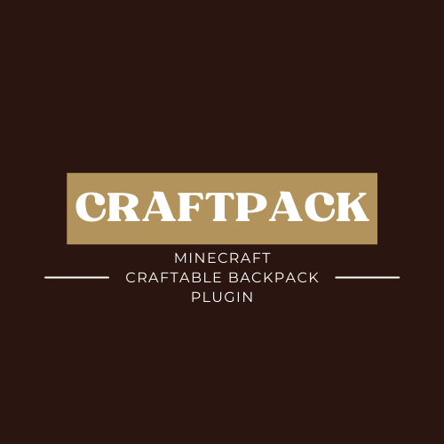

# Craftpack
The official documentation for the Craftpack Minecraft plugin
####  

_A craftable Minecraft Backpack Plugin_
####  

*Craftpack* brings very simple, craftable backpacks for your players within your server worlds. Using very simple receipes to craft the packs, your players can begin wandering aboot the landscape with 27, 36, 45, or 54 slot backpacks, giving them the space and safety to explore and find and save their valuable items!  

And the best part, **Craftpack**'s can be created as many times as you want, and they can be stored inside of eachother! **_PACK IN PACKS IN PACKS!!!_**  
####  

### Use-Case:
To access your pack, **Right-Click** the pack in your inventory and your pack storage will open to you! **RIGHT-CLICK THE PACK...**

## Sections
1. [Recipes](recipes.md)
2. [Configuration / Commands / Permissions](interactives.md)
####  

## Support
**F4ngdev** is always working tirelessly to ensure quality functional plugins, and should any questions or needs arise, we invite you to open a support ticket here on the **CakeSMP Github** where we can manage and get all things plugin related handled. If this forum isn't working for you, we always have the [**F4ngdev Discord**](https://discord.gg/k28sR69n5f) where everything plugin and development related is open-discussion.
